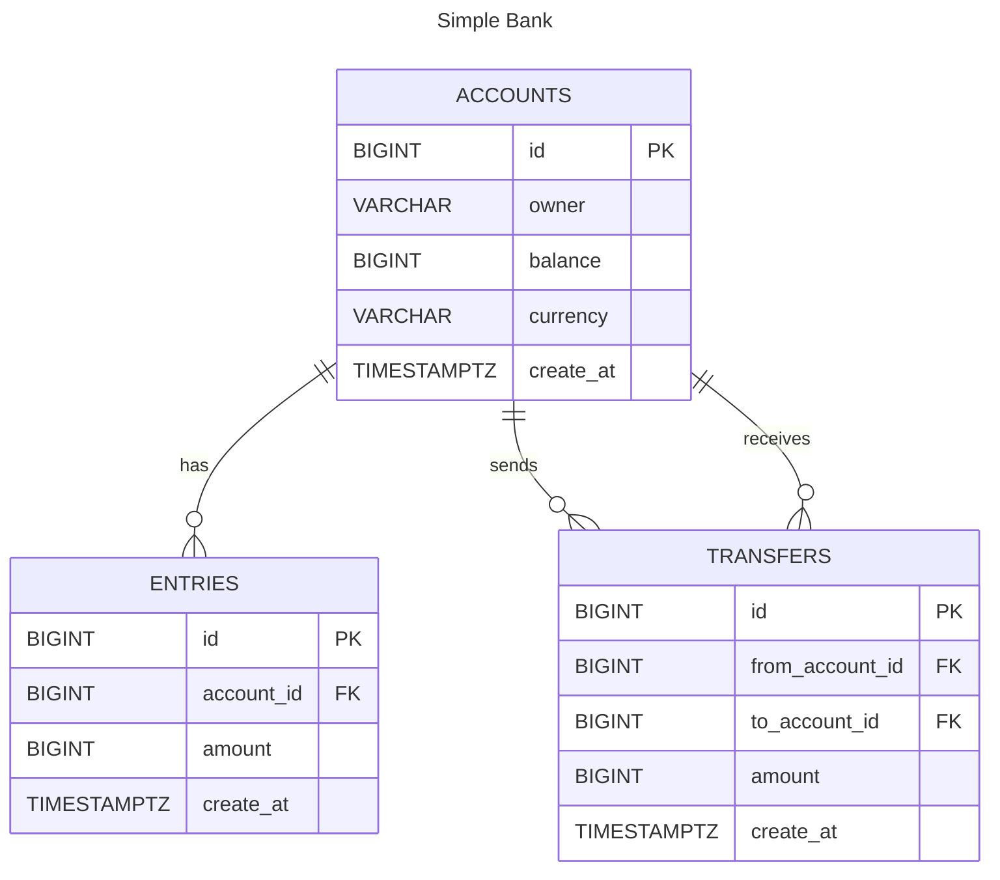

```mermaid
---
title: Simple Bank
---
erDiagram
    ACCOUNTS {
        BIGINT id PK
        VARCHAR owner
        BIGINT balance
        VARCHAR currency
        TIMESTAMPTZ create_at
    }

    ENTRIES {
        BIGINT id PK
        BIGINT account_id FK
        BIGINT amount
        TIMESTAMPTZ create_at
    }

    TRANSFERS {
        BIGINT id PK
        BIGINT from_account_id FK
        BIGINT to_account_id FK
        BIGINT amount
        TIMESTAMPTZ create_at
    }

    ACCOUNTS ||--o{ ENTRIES : has
    ACCOUNTS ||--o{ TRANSFERS : sends
    ACCOUNTS ||--o{ TRANSFERS : receives
```